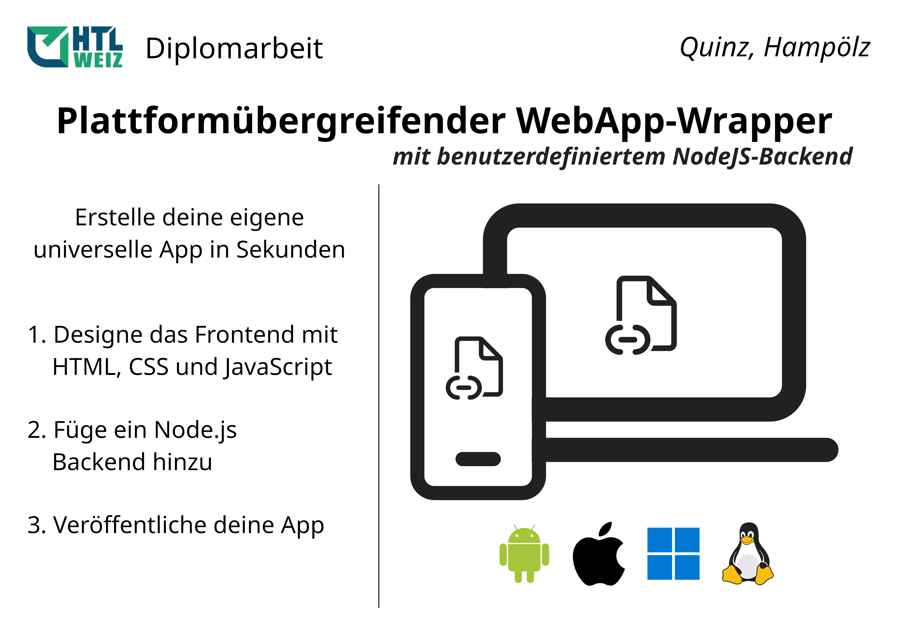
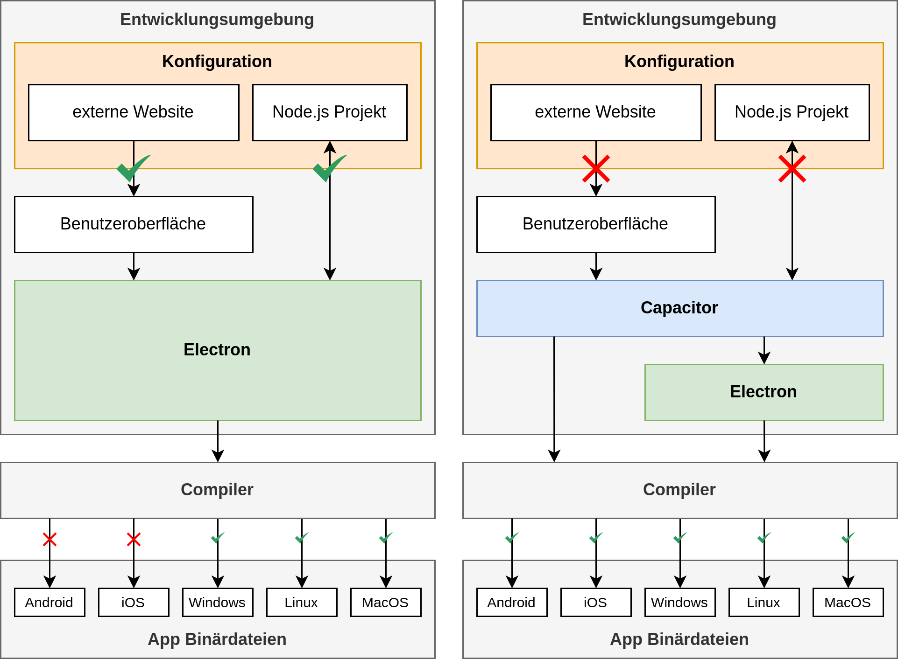
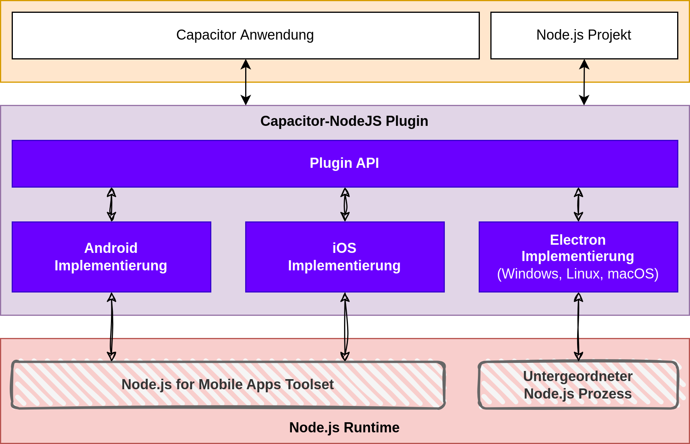
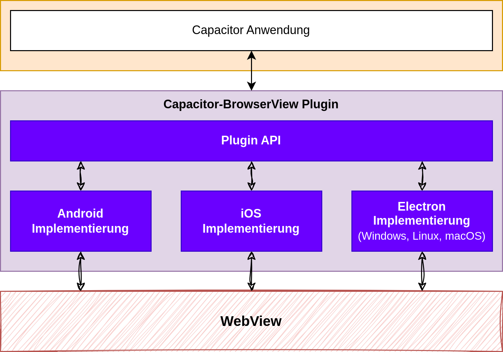

# Plattformübergreifender WebApp-Wrapper

mit benutzerdefiniertem Node.js-Backend

---

# Inhalt

1. Zielsetzung
2. Problemstellung
3. Umsetzung
4. Ergebnisse

---
<!--
_header: ""
_footer: ""
-->

---

# Problemstellung

---
<!--
_header: ""
_footer: ""
-->

---

# Umsetzung

- Capacitor-NodeJS
- Capacitor-BrowserView

---
<!--
_header: ""
_footer: ""
-->

---
<!--
_header: ""
_footer: ""
-->

---

# Ergebnisse

---

<!--
header: ""
footer: ""
backgroundColor: #000000
paginate: false
-->

<video muted class="bg" style="height:720px" onclick="this.paused ? this.play() : this.pause(); this.blur()" onpause="">
    <source src="./assets/04_Beispiel_Linux.webm" type="video/webm">
</video>

---

<video muted class="bg" style="height:720px" onclick="this.paused ? this.play() : this.pause(); this.blur()" onpause="">
    <source src="./assets/05_Beispiel_Windows.webm" type="video/webm">
</video>

---

<video muted class="bg" style="height:720px" onclick="this.paused ? this.play() : this.pause(); this.blur()" onpause="">
    <source src="./assets/06_Beispiel_Android.webm" type="video/webm">
</video>

---
